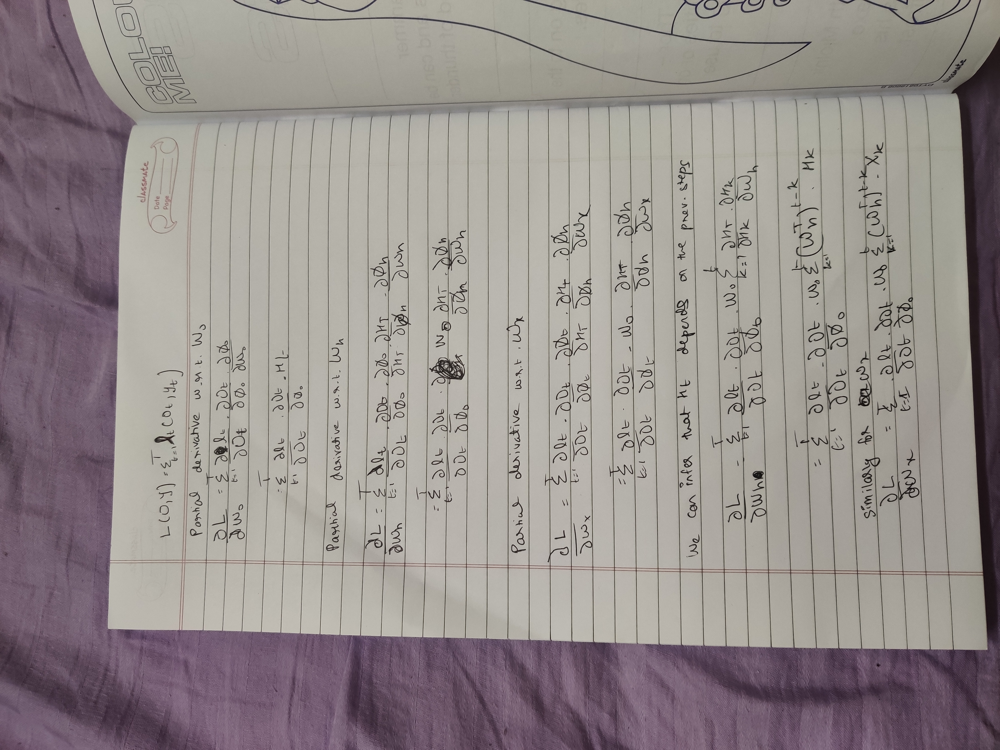

# Recurrent Neural Networks

## What is Recurrent neural network?

**Recurrent Neural Networks (RNNs)** are a type of neural network architecture 
which is mainly used to detect patterns in a sequence of data. Such data 
can be handwriting, genomes,music, text or numeric time series .However, 
they are also applicable to images if these get respectively decomposed 
into a series of patches and treated as a sequence . On a higher level, 
RNNs find applications in **Generating Text,Speech Recognition,Video Tagging.**  

    
     
    Image source:https://towardsdatascience.com/understanding-rnn-and-lstm-f7cdf6dfc14e

 

## How is it different from a feed forward neural network?

What differentiates Recurrent Neural Networks from Feedforward Neural Networks is how **information 
gets passed through the network.** While Feedforward Networks pass information through the network 
without cycles, the **RNN has cycles and transmits information back into itself.** This enables them to 
extend the functionality of Feed forward Networks to also take into account previous inputs X0:t−1 and 
not only the current input Xt ,in simple terms rnn remembers previous values.
 

    
     
    

 

## Important notations:

From the (first figure)[./assets/rnn1.png] we can infer that the rnn first, takes the **X(0)** from the sequence of input and then it 
outputs **h(0)** which together with **X(1)** is the input for the next step. So, the **h(0)** and **X(1)** is the input 
for the next step. Similarly, **h(1)** from the next is the input with **X(2)** for the next step and so on. 
This way, it keeps remembering the context while training.
Therefore a particular state in a rnn can be described as:
**ht=f(ht-1,xt)** 
f denotes an activation function here.  
Let Ø represent any activation function, 
ht= Ø(Wxxt+Whht-1+b) 
Wx -> Weight at the input state 
Wh -> Weight at the hidden state 
b -> bias of the hidden state 
Putting all this together the output state is:  

Ot=Ø(htWo+bo) 
Wo->Weight of the output state 
bo-> bias of the output state 

**Since RNNs are sequences of inputs, an approach backpropagation through time is adopted.**

## Backpropagation through time: 

Backpropagation Through Time is the adaption of the backpropagation algorithm for **RNNs**. In theory, this unfolds 
the RNN to construct a traditional Feedforward Neural Network where we can apply backpropagation. For that, we use 
the same notations for the RNN as proposed before.When we forward pass our input Xt through the network we compute the 
hidden state Ht and the output state Ot one step at a time. We can then define a loss function L(O,Y) to describe the 
difference between all outputs Ot and target value Y. This basically sums up every loss term lt of each update step so far. 
This loss term lt have different definitions based on the specific problem (e.g. Mean Squared Error, Cross Entropy Loss, Binary Cross Entropy  Loss etc.).
Let the input sequences be from 1 to T 
Let the loss function be defined as: 

Since we have three weight matrices Wx,Wh and Wo  ,we need to compute the **partial derivative w.r.t. to each of these weight matrices. 
With the chain rule which is also used in normal backpropagation .**

    
     
    

## Advantages: 
1). RNN can model sequences of data,i.e. remembers the values of previous set of inputs. 
2). RNNs can process inputs of any length. 
3). RNN are even used with convolutional layers to extend the effective pixel neighborhood. 

## Disadvantages: 
1).Vanishing and exploding gradients. 
2).RNNs are computationally slow. 

    
     
    

## Code Implementation: 
[Click here](./rnn.py)

## References:
https://www.google.com/url?sa=t&rct=j&q=&esrc=s&source=web&cd=&cad=rja&uact=8&ved=2ahUKEwj93oPDiMbuAhUS5nMBHQtBCEoQFjABegQIARAC&url=https%3A%2F%2Farxiv.org%2Fabs%2F1808.03314&usg=AOvVaw2pRRA2BHdxMQ0_j5c8_baf  
https://www.google.com/url?sa=t&rct=j&q=&esrc=s&source=web&cd=&cad=rja&uact=8&ved=2ahUKEwj93oPDiMbuAhUS5nMBHQtBCEoQFjAGegQICRAC&url=https%3A%2F%2Fwww.ijcai.org%2FProceedings%2F16%2FPapers%2F408.pdf&usg=AOvVaw3csL-yYL5hsvDLyqjPHBcm  
https://www.google.com/url?sa=t&rct=j&q=&esrc=s&source=web&cd=&cad=rja&uact=8&ved=2ahUKEwjq6Z_fiMbuAhU3_XMBHbGVADwQFjACegQIBRAC&url=http%3A%2F%2Fwww.scholarpedia.org%2Farticle%2FRecurrent_neural_networks&usg=AOvVaw3VkYqNP_me-CoRFeD7whBN
