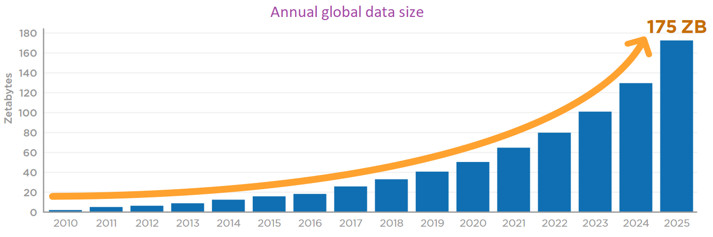
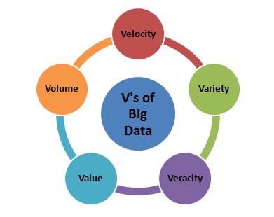
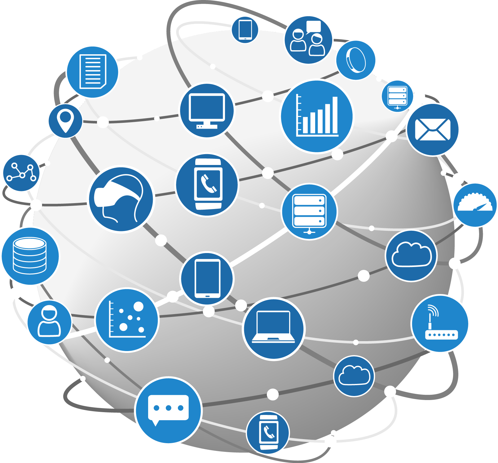
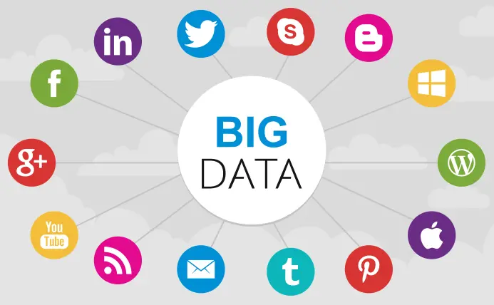

Big Data
========

Introduction
------------

Quoting the words of Pat Gelsinger, the CEO of Intel **“Data is the new
science, Big Data holds the answers”.** In the past we had to rely on
experienced professionals regarding critical decisions. Times have
changed and we are now looking towards the Data based decisions approach
to provide more accurate decisions to minimize human error and maximize
the efficiencies of these industries. Data is a priceless resource that
is growing at a staggering rate. The amount of total data in the world
by 2025 will reach around **175 ZettaBytes** (1 Zettabyte=1 billion
Terabyte) by 2025. The total volume of data is being doubled every two
years. Total size growth of data worldwide, year to year as per IDC
report is shown below:

    

  Image
source:https://www.geeksforgeeks.org/what-is-big-data/

 

Big Data defined
----------------

Big data is **data that contains greater variety arriving in increasing
volumes and with ever-higher velocity.** This is known as the three Vs.
Put simply, big data is larger, more complex data sets, especially from
new data sources (business transactions, smart (IoT) devices,social
media and more). These data sets are so voluminous that traditional data
processing software just can’t manage them. These massive volumes of
data however can be used to address business problems you wouldn’t have
been able to tackle before.

The Five V's
------------

The concept of big data gained momentum in the early 2000s when industry
analyst Doug Laney articulated the now-mainstream definition of big data
as the three V’s: 

**Volume:**   The amount of data matters. This can be data of
unknown value, such as Twitter data feeds or sensor-enabled equipment.
For some organizations, this might be tens of terabytes of data. For
others, it may be hundreds of petabytes.\
In the past, storing it would have been a problem – but cheaper storage
on platforms like data lakes and Hadoop have eased the burden. 
**Velocity:**   With the growth in the Internet of Things, data
streams in to businesses at an unprecedented speed. Internet-enabled
smart products (RFID tags, sensors, smart meters and so on) will require
real-time evaluation and action. How fast the data is generated and
processed to meet the demands, determines real potential in the data.
  **Variety:**   Traditional data types were structured and fit
neatly in a relational database. With the rise of big data, data comes
in all types of formats – unstructured text documents, videos, audios,
financial transactions. Unstructured and semistructured data types, such
as text, audio, and video, require additional preprocessing in order to
be useful. 

Two more Vs have emerged over the past few years: variability and
veracity. 

**Variability:**   In addition to the increasing velocities and
varieties of data, data flows are unpredictable – changing often and
varying greatly. It’s challenging, but businesses need to know when
something is trending on social media, and how to manage daily, seasonal
and event-triggered peak data loads.  **Veracity:**   Veracity
refers to the quality of data. Data comes from a multitude of sources,
it’s difficult to link, match, cleanse and transform data across
systems. Businesses need to connect and correlate relationships. Data in
itself is of no use or importance but it needs to be converted into
something valuable to extract information. 

    
   Image
source:https://java2blog.com/big-data-introduction/

 

Types Of Big Data
-----------------

1)Structured  Any data that can be stored, accessed and processed in
the form of **fixed format** is termed as a structured data. 
2)Unstructured  Unstructured data is information that is
**unorganized** and does not fall into a predetermined format. It poses
multiple challenges in terms of its processing for deriving value out of
it.   3)Semi-structured  Semi-structured data can contain **both
the forms of data**. We can see semi-structured data as a structured in
form but it is actually not defined with e.g. a table definition in
relational DBMS. Example of semi-structured data is a data represented
in an XML file. 

    
   Image
source:https://www.delltechnologies.com/en-us/blog/not-using-full-backup-big-data/

 

Why Is Big Data Important?
--------------------------

**The importance of big data doesn’t revolve around how much data you
have, but what you do with it**. Today, big data has become crucial.
Think of some of the world’s biggest tech companies. A large part of the
value they offer comes from their data, which they’re constantly
analyzing to produce more efficiency and develop new products. Recent
technological breakthroughs have exponentially reduced the cost of data
storage and compute. Finding value in big data isn’t only about
analyzing it. It’s an entire **discovery process** that requires
insightful analysts, business users, and executives who ask the right
questions, recognize patterns, make informed assumptions, and predict
behavior.

    
  
Image
source:https://www.smartdatacollective.com/big-data-20-free-big-data-sources-everyone-should-know/

 

References
----------

https://www.oracle.com/big-data/what-is-big-data/ 
https://www.sas.com/en\_us/insights/big-data/what-is-big-data.html 
https://www.geeksforgeeks.org/big-data-as-a-technology/ 
https://www.mailjet.com/blog/news/what-is-big-data/\#Types 

**Fun Fact**:A single Jet engine can generate 10+terabytes of data in 30
minutes of flight time
